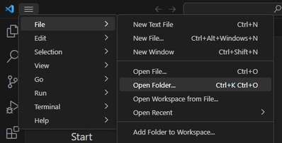

# Ejemplos 

Este directorio contiene diversos ejemplos que se utilizaran a lo largo del curso, con aplicaciones de procesamiento digital de señales corriendo sobre un módulo ESP32.

## Modo de uso

> **NOTA:** Para trabajar con el ESP32 en este curso utilizaremos framework del fabricante [ESP-IDF](https://docs.espressif.com/projects/esp-idf/en/latest/esp32/index.html) y como entorno de desarrollo el [Visual Studio Code](https://code.visualstudio.com/).

**1-** Instalar VSCode y el complemento de ESP-IDF siguiendo el [tutorial](https://github.com/espressif/vscode-esp-idf-extension/blob/master/docs/tutorial/install.md).

**2-** Clonar este Repositorio en un directorio de su PC (se recomienda que en la ruta no haya carpetas con espacios ni caracteres especiales).

**3-** Para probar un ejemplo, desde VSCode abra la carpeta del proyecto correspondiente (*File->Open Folder...*).


   
​Debería ver la siguiente configuración de archivos:


> **NOTA:** VSCode le mostrará varios pop-up abajo a la derecha, recomendando la instalación de extensiones. Puede hacer caso omiso a la mismas.

**4-** Conecte la placa ESP32 a su PC.

**5-** Configure en VSCode el puerto COM correspondiente donde se encuentra conectado su ESP32.


**6-** Compile el ejemplo pulsando el boton ``ESP-IDF Build project``.

​
​

Se abrirá un nuevo terminal donde se irán mostrando las salidas del proceso de compilación. Un vez finalizado el proceso se abrirá un segundo terminal mostrando la información de memoria. 


**7-** Programe la placa ESP32 pulsando el boton ``ESP-IDF Flash device``.


**8-** Para observar los resultados de la ejecución del programa, abra un nuevo ``ESP-IDF Terminal`` y luego ejecute la siguiente línea:
```
idf.py -p "COMX" -b 921600 monitor
```


**9-** Para cerrar el monitor ejecute en la terminal ``Ctrl-T`` y luego ``Ctrl-X``.


